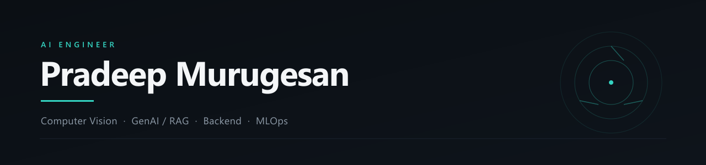

  <picture>
    <source media="(prefers-color-scheme: dark)" srcset="assets/header-dark.svg" />
    <source media="(prefers-color-scheme: light)" srcset="assets/header-light.svg" />
    
  </picture>

  
  
  
  

 

## What I build

Real-time **computer vision** and **GenAI / RAG** systems: low-latency GPU inference
pipelines and the scalable FastAPI microservices that serve them in production.

- **Vision** &nbsp;·&nbsp; detection and tracking pipelines, GPU inference, ONNX / TensorRT export
- **GenAI** &nbsp;·&nbsp; retrieval pipelines, vector search, local and hosted LLM serving
- **Backend** &nbsp;·&nbsp; FastAPI services, queues and caching, containerised deploys

Reach me at **pradeepmurugesan.dev@gmail.com**.

 

## Stack

**Vision & ML**

  
  
  
  
  
  

**GenAI**

  
  
  
  
  

**Backend & Data**

  
  
  
  
  

**Infra**

  
  
  
  
  

 

## Featured projects

<table>
  <tr>
    <td width="50%" valign="top">
      <a href="https://github.com/Mpradeep-dev/Auto_Label_Flow"><b>Auto_Label_Flow</b></a> 
      Auto-labelling pipeline that turns raw image frames into training-ready annotations.  
      
      
    </td>
    <td width="50%" valign="top">
      <a href="https://github.com/solnae-tech/wound_care-wound-service"><b>wound_care-wound-service</b></a> 
      Wound-assessment microservice: segmentation and measurement over clinical images.  
      
      
    </td>
  </tr>
  <tr>
    <td width="50%" valign="top">
      <a href="https://github.com/Mpradeep-dev/EstimaX-AI"><b>EstimaX-AI</b></a> 
      AI service for project cost and effort estimation from structured inputs.  
      
      
    </td>
    <td width="50%" valign="top">
      <a href="https://github.com/Mpradeep-dev/FAQ-bot"><b>FAQ-bot</b></a> 
      Retrieval-augmented FAQ assistant over a private knowledge base.  
      
      
    </td>
  </tr>
  <tr>
    <td width="50%" valign="top">
      <a href="https://github.com/Mpradeep-dev/AI_Trainer"><b>AI_Trainer</b></a> 
      Real-time exercise form coach driven by pose estimation.  
      
      
    </td>
    <td width="50%" valign="top">
      <a href="https://github.com/Mpradeep-dev/drowsiness-detection"><b>drowsiness-detection</b></a> 
      Driver drowsiness detection from eye-aspect-ratio and head pose.  
      
      
    </td>
  </tr>
</table>

Descriptions are placeholders. Edit them to match each repo.

 

## Activity

<!--
  GitHub stats + top languages are omitted: the shared github-readme-stats.vercel.app
  instance is currently paused (HTTP 503) and github-readme-activity-graph is disabled
  (HTTP 402). To bring them back reliably, deploy your own github-readme-stats instance
  to Vercel and point the URLs at <your-instance>.vercel.app/api?username=Mpradeep-dev...
-->

  

  <picture>
    <source media="(prefers-color-scheme: dark)" srcset="https://raw.githubusercontent.com/Mpradeep-dev/Mpradeep-dev/output/github-contribution-grid-snake-dark.svg" />
    <source media="(prefers-color-scheme: light)" srcset="https://raw.githubusercontent.com/Mpradeep-dev/Mpradeep-dev/output/github-contribution-grid-snake.svg" />
    
  </picture>

 

## Verified badges

<table>
  <tr>
    <td align="center" width="33%">
      
       <b>Credly verified</b>
    </td>
    <td align="center" width="33%">
      
       <b>Azure AI: plan and prepare to develop AI solutions</b>
    </td>
    <td align="center" width="33%">
      
       <b>Microsoft Foundry: select, deploy, evaluate models</b>
    </td>
  </tr>
</table>

 

Open to collaboration and roles in applied AI. &nbsp;·&nbsp; <a href="#top">Back to top</a>
